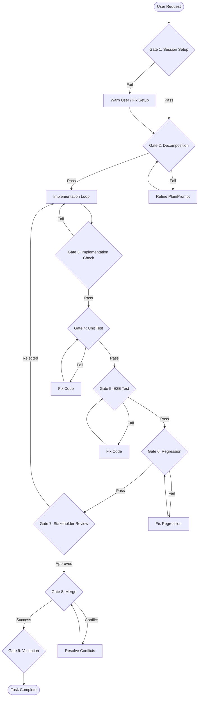

# General Gate Policies

This document establishes the universal rules and behaviors that apply to all gates within the Dax workflow.

## 1. The "Warn-Only" Policy

**Philosophy**: Dax suggests, the Stakeholder decides.

- **Rule**: All gates are technically **non-blocking** (Warn-Only).
- **Behavior**: If a gate fails, the agent must:
    1.  **Stop**: Pause execution.
    2.  **Report**: Clearly state *why* the gate failed (e.g., "Unit verification failed: 3 tests failing").
    3.  **Ask**: Prompt the user for a decision. "Do you want to fix this, or strictly override and proceed?"
- **Reasoning**: Rigid enforcement often leads to "death spirals" where an agent gets stuck. Users may have context the agent lacks (e.g., "I know that test is flaky, ignore it").

## 2. Standard Pass/Fail Output Format

Every gate check must output a structured status to the context (logs or chat) to ensure clarity.

**Format**:
```
[GATE: <Gate Name>] Status: <PASS/FAIL>
Details: <One-line summary of result>
Action: <Next step>
```

**Examples**:
- *Pass*:
  ```
  [GATE: Unit Test] Status: PASS
  Details: 12/12 tests passed.
  Action: Proceeding to E2E Test Gate.
  ```
- *Fail*:
  ```
  [GATE: Scope] Status: FAIL
  Details: Detected changes in 'auth.ts' which is out of scope for 'Update UI'.
  Action: WARN USER. Waiting for override or directive to revert.
  ```

## 3. Stakeholder Overrides

When a gate fails, the Stakeholder (User) has the authority to issue an override.

- **Explicit Override**: The user must explicitly say something like "Ignore that error," "Proceed anyway," or "Force merge."
- **Agent Responsibility**:
    - The agent *must* record the override in its internal context (e.g., "User acknowledged risk and forced progression").
    - The agent *should not* argue after one warning.
    - If the override leads to a known critical failure (e.g., "Merging allows syntax errors"), the agent may issue a "Critical Caution" before complying.

## 4. Master Gate Flow

The following sequence describes the standard lifecycle of a task through the gates.



### Flow Summary
1.  **Entry**: Validate environment -> Decompose task.
2.  **Execution**: Write Code -> Unit Test -> E2E Test.
3.  **Closure**: Regression Test -> Review -> Merge -> Validate.
