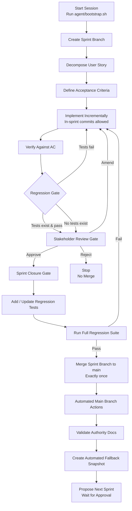

# Development Workflow (Visual)

```mermaid
flowchart TD
    A[Start Session<br/>Run agent/bootstrap.sh] --> B[Create Sprint Branch]

    B --> C[Decompose User Story]
    C --> D[Define Acceptance Criteria]
    D --> E[Implement Incrementally<br/>In-sprint commits allowed]
    E --> F[Verify Against AC]

    F --> G{Regression Gate}
    G -->|Tests exist & pass| H[Stakeholder Review Gate]
    G -->|Tests fail| E
    G -->|No tests exist| H

    H -->|Approve| I[Sprint Closure Gate]
    H -->|Amend| E
    H -->|Reject| J[Stop<br/>No Merge]

    I --> K[Add / Update Regression Tests]
    K --> L[Run Full Regression Suite]

    L -->|Fail| E
    L -->|Pass| M[Merge Sprint Branch to main<br/>Exactly once]

    M --> N[Automated Main Branch Actions]
    N --> O[Validate Authority Docs]
    O --> P[Create Automated Fallback Snapshot]
    P --> Q[Propose Next Sprint<br/>Wait for Approval]
```
